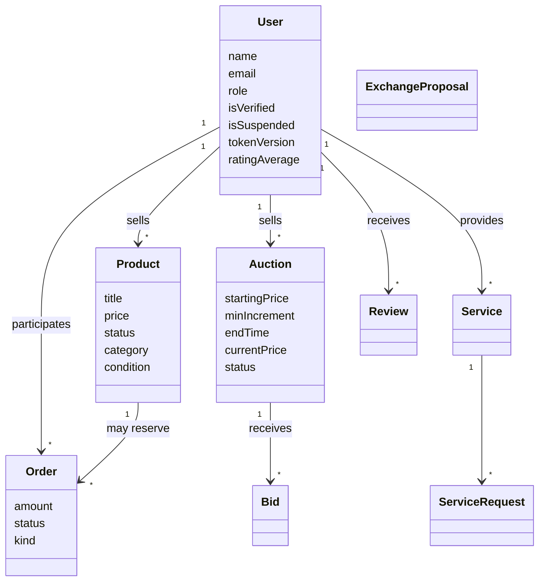

# Class diagram

```mermaid
classDiagram
  class User {
    name
    email
    role
    isVerified
    isSuspended
    tokenVersion
    ratingAverage
  }
  class Product {
    title
    price
    status
    category
    condition
  }
  class Auction {
    startingPrice
    minIncrement
    endTime
    currentPrice
    status
  }
  class Order {
    amount
    status
    kind
  }
  class Service
  class ServiceRequest
  class ExchangeProposal
  class Review
  User "1" --> "*" Product : sells
  User "1" --> "*" Auction : sells
  Auction "1" --> "*" Bid : receives
  User "1" --> "*" Order : participates
  Product "1" --> "*" Order : may reserve
  User "1" --> "*" Service : provides
  Service "1" --> "*" ServiceRequest
  User "1" --> "*" Review : receives
```

Controllers depend on services. Services depend on models. The React pages depend on the API client, not on Mongoose.
