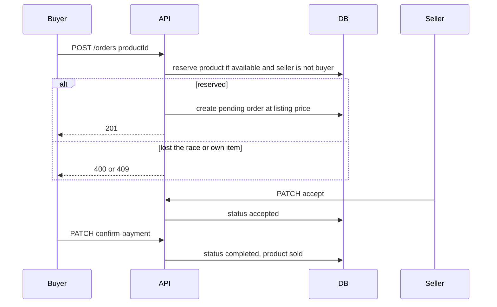
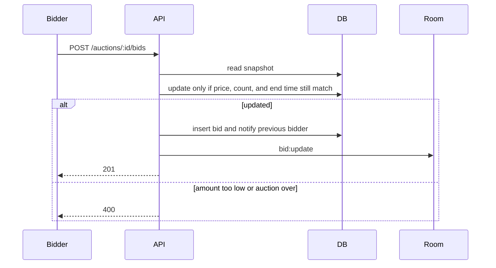
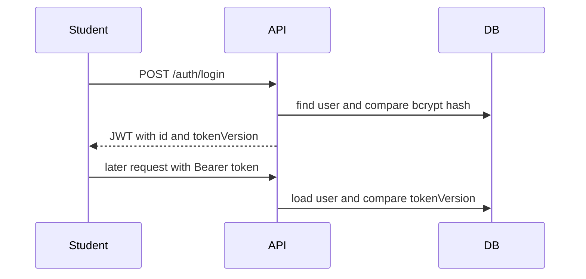

# Sequence diagrams

## Purchase

```mermaid
sequenceDiagram
  participant Buyer
  participant API
  participant DB
  Buyer->>API: POST /orders productId
  API->>DB: reserve product if available and seller is not buyer
  alt reserved
    API->>DB: create pending order at listing price
    API-->>Buyer: 201
  else lost the race or own item
    API-->>Buyer: 400 or 409
  end
  participant Seller
  Seller->>API: PATCH accept
  API->>DB: status accepted
  Buyer->>API: PATCH confirm-payment
  API->>DB: status completed, product sold
```

## Bid

```mermaid
sequenceDiagram
  participant Bidder
  participant API
  participant DB
  participant Room
  Bidder->>API: POST /auctions/:id/bids
  API->>DB: read snapshot
  API->>DB: update only if price, count, and end time still match
  alt updated
    API->>DB: insert bid and notify previous bidder
    API->>Room: bid:update
    API-->>Bidder: 201
  else amount too low or auction over
    API-->>Bidder: 400
  end
```

## Login

```mermaid
sequenceDiagram
  participant Student
  participant API
  participant DB
  Student->>API: POST /auth/login
  API->>DB: find user and compare bcrypt hash
  API-->>Student: JWT with id and tokenVersion
  Student->>API: later request with Bearer token
  API->>DB: load user and compare tokenVersion
```
