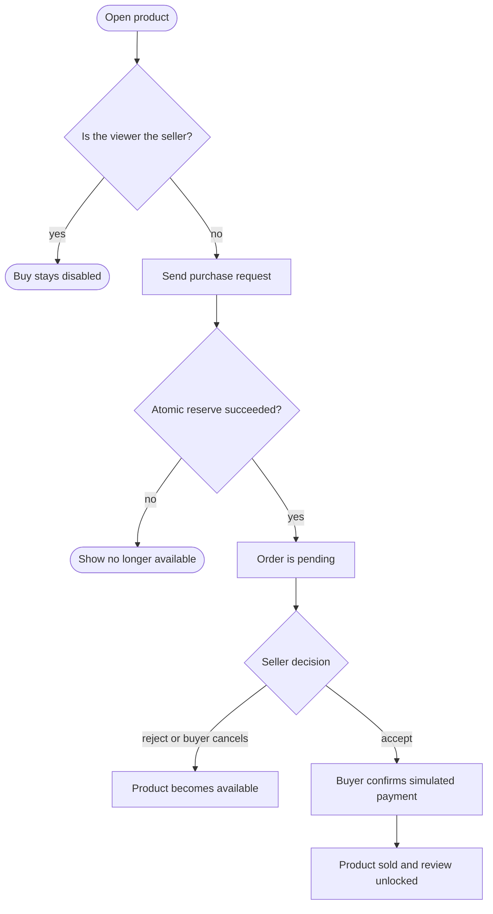

# Activity diagram

## Buying a product

```mermaid
flowchart TD
  Start([Open product]) --> Own{Is the viewer the seller?}
  Own -->|yes| StopOwn([Buy stays disabled])
  Own -->|no| Request[Send purchase request]
  Request --> Reserved{Atomic reserve succeeded?}
  Reserved -->|no| StopGone([Show no longer available])
  Reserved -->|yes| Pending[Order is pending]
  Pending --> Decision{Seller decision}
  Decision -->|reject or buyer cancels| Free[Product becomes available]
  Decision -->|accept| Pay[Buyer confirms simulated payment]
  Pay --> Sold[Product sold and review unlocked]
```
