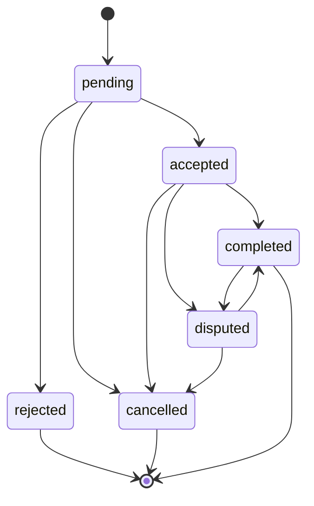
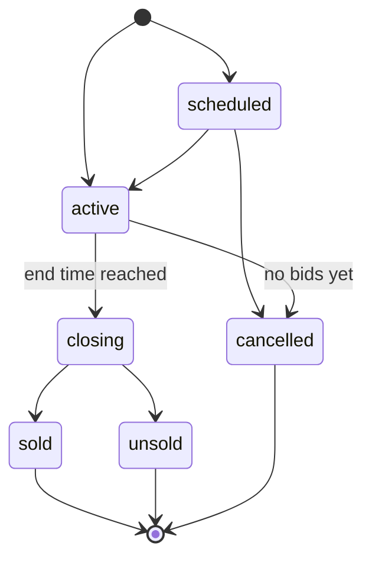

# State diagram

## Order

```mermaid
stateDiagram-v2
  [*] --> pending
  pending --> accepted
  pending --> rejected
  pending --> cancelled
  accepted --> completed
  accepted --> cancelled
  accepted --> disputed
  completed --> disputed
  disputed --> completed
  disputed --> cancelled
  rejected --> [*]
  cancelled --> [*]
  completed --> [*]
```

## Auction

```mermaid
stateDiagram-v2
  [*] --> scheduled
  [*] --> active
  scheduled --> active
  scheduled --> cancelled
  active --> cancelled: no bids yet
  active --> closing: end time reached
  closing --> sold
  closing --> unsold
  sold --> [*]
  unsold --> [*]
  cancelled --> [*]
```

A seller cancel is refused once `bidCount` is greater than zero. Admin removal can still cancel an auction as a moderation action.
